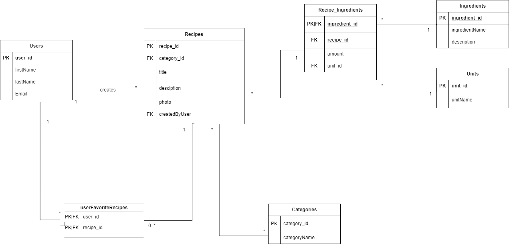

# Shean Looghe (077217sl)

- [ ] Front-end Web Development
  - <GITHUB_REPO_LINK_HIER>
  - <LINK_ONLINE_VERSIE_HIER>
- [x] Web Services: GITHUB URL
  - <[GITHUB_REPO_LINK_HIER](https://github.com/Web-IV/2324-webservices-SheanLooghe)>
  - <[LINK_ONLINE_VERSIE_HIER](https://webservice-recipes2324.onrender.com)>
  -

**Logingegevens**

- Gebruikersnaam/e-mailadres: <shean.looghe@student.hogent.be> <- Admin>
- Wachtwoord: password

- Gebruikersnaam/e-mailadres: <amoxley1@jiathis.com>
- Wachtwoord: password1

- Gebruikersnaam/e-mailadres: <lbischof2@soup.io>
- Wachtwoord: password2

- Gebruikersnaam/e-mailadres: <dboni3@whitehouse.gov>
- Wachtwoord: password3

- Gebruikersnaam/e-mailadres: <smcbrier4@geocities.com>
- Wachtwoord: password4

## Projectbeschrijving

> Dit project is een recepten website. Waar een gebruiker een   

- **Users**
  - user_id: unieke id van de gebruiker --> int
  - firstName: voornaam van de gebruiker --> string
  - lastName: achternaam van de gebruiker --> string
  - Email: email van de gebruiker --> string
- **Recipes**
  - recipe_id: unieke id van het recept --> int
  - category_id: foreign key van de categorie --> int
  - title: titel van het recept --> string
  - description: beschrijving van het recept --> string
  - image: afbeelding van het recept --> string
  - createdByUser: foreign key van de gebruiker die het recept heeft aangemaakt --> int
- **UserFavourtieRecipes**
  - user_id: foreign key van de gebruiker --> int
  - recipe_id: foreign key van het recept --> int
  - samenstelling van de 2 foreign keys is uniek (user_id, recipe_id)
- **Categories**
  - category_id: unieke id van de categorie --> int
  - categoryName: naam van de categorie --> string
- **Recipe_Ingredients**
  - ingredient_id: foreign key van het ingredient, primary key van de tussentabel --> int
  - recipe_id: foreign key van het recept --> int
  - amount: hoeveelheid van het ingredient --> int
  - unit_id: foreign key van de eenheid --> int
- **Ingredients**
  - ingredient_id: unieke id van het ingredient --> int
  - ingredientName: naam van het ingredient --> string
  - description: beschrijving van het ingredient --> string
- **Units**
  - unit_id: unieke id van de eenheid --> int
  - unitName: naam van de eenheid --> string

## Opstart van de applicatie

yarn install  
-add .env file <NODE_ENV=development
DATABASE_PASSWORD=root>  
yarn start  
-add .env.test file <NODE_ENV=test
DATABASE_PASSWORD=root>  
yarn test  

## API calls

> Maak hier een oplijsting van alle API cals in jouw applicatie. Groepeer dit per entiteit. Hieronder een voorbeeld.
> Dit is weinig zinvol indien je enkel Front-end Web Development volgt, verwijder dan deze sectie.
> Indien je als extra Swagger koos, dan voeg je hier een link toe naar jouw online documentatie. Swagger geeft nl. exact (en nog veel meer) wat je hieronder moet schrijven.

### User

- `GET /api/users`: alle gebruikers ophalen
- `GET /api/users/:user_id`: gebruiker met een bepaald id ophalen
- `POST /api/users/:`: gebruiker toevoegen
- `PUT /api/users/:user_id`: gebruiker met een bepaald id aanpassen
- `DELETE /api/users/:user_id`: gebruiker met een bepaald id verwijderen

### Category

- `GET /api/categories`: alle categorieën ophalen
- `GET /api/categories/:category_id`: categorie met een bepaald id ophalen
- `POST /api/categories/:`: categorie toevoegen
- `PUT /api/categories/:category_id`: categorie met een bepaald id aanpassen
- `DELETE /api/categories/:category_id`: categorie met een bepaald id verwijderen

### Recipe
  
- `GET /api/recipes`: alle recepten ophalen
- `GET /api/recipes/:recipe_id`: recept met een bepaald id ophalen
- `POST /api/recipes/:`: recept toevoegen
- `PUT /api/recipes/:recipe_id`: recept met een bepaald id aanpassen
- `DELETE /api/recipes/:recipe_id`: recept met een bepaald id verwijderen
  
### Ingredient

- `GET /api/ingredients`: alle ingredienten ophalen
- `GET /api/ingredients/:ingredient_id`: ingredient met een bepaald id ophalen
- `POST /api/ingredients/:`: ingredient toevoegen
- `PUT /api/ingredients/:ingredient_id`: ingredient met een bepaald id aanpassen
- `DELETE /api/ingredients/:ingredient_id`: ingredient met een bepaald id verwijderen

### Unit

- `GET /api/units`: alle eenheden ophalen
- `GET /api/units/:unit_id`: eenheid met een bepaald id ophalen
- `POST /api/units/:`: eenheid toevoegen
- `PUT /api/units/:unit_id`: eenheid met een bepaald id aanpassen
- `DELETE /api/units/:unit_id`: eenheid met een bepaald id verwijderen

## Behaalde minimumvereisten

### Web Services

- **datalaag**

  - [x] voldoende complex (meer dan één tabel, 2 een-op-veel of veel-op-veel relaties)
  - [x] één module beheert de connectie + connectie wordt gesloten bij sluiten server
  - [x] heeft migraties - indien van toepassing
  - [x] heeft seeds
 

- **repositorylaag**

  - [x] definieert één repository per entiteit (niet voor tussentabellen) - indien van toepassing
  - [x] mapt OO-rijke data naar relationele tabellen en vice versa - indien van toepassing
 

- **servicelaag met een zekere complexiteit**

  - [x] bevat alle domeinlogica
  - [x] bevat geen SQL-queries of databank-gerelateerde code
 

- **REST-laag**

  - [x] meerdere routes met invoervalidatie
  - [x] degelijke foutboodschappen
  - [x] volgt de conventies van een RESTful API
  - [x] bevat geen domeinlogica
  - [x] geen API calls voor entiteiten die geen zin hebben zonder hun ouder (bvb tussentabellen)
  - [x] degelijke authorisatie/authenticatie op alle routes
 

- **algemeen**

  - [x] er is een minimum aan logging voorzien
  - [ ] een aantal niet-triviale integratietesten (min. 1 controller >=80% coverage)
  - [ ] minstens één extra technologie
  - [x] maakt gebruik van de laatste ES-features (async/await, object destructuring, spread operator...)
  - [x] duidelijke en volledige README.md
  - [x] volledig en tijdig ingediend dossier en voldoende commits

## Projectstructuur

### Web Services

> De mappenstructuur gaat als volgt:  
>
> - **Test**: bevat de testen  
> - **Config**: bevat de configuratie van de databank  
> - **Src**: bevat de code  
    > - **core**: bevat   
    > - **data**: bevat de migraties en seeds  
    > - **repository**: bevat de data die afkomstig is uit de databank  
    > - **rest**: bevat de routes/endpoints  
    > - **service**: bevat de logica van de applicatie en gooit foutboodschappen  
> - **.env**: bevat de login gegevens van de databank  
> - **.env.test**: bevat de login gegevens van de test databank 

## Extra technologie

### Web Services

> Geen extra technologie gebruikt.

## Testresultaten

### Web Services

> De testen werken niet meer na toevoeging van authenticatie. Deze werkte op commit ea831e4  
> (De category restlaag was voor 100% getest)  
> Categorieën testen:  
> Get: /api/categories
>
> - 200: OK  
> - 400: Bad Request  
> GET /api/categories/:category_id
> - 200: OK  
> - 400: Bad Request  
> - 404: Not Found  
> POST /api/categories
> - 201: Created  
> - 400: Bad Request  
> PUT /api/categories/:category_id
> - 200: OK  
> - 400: Bad Request  
> - 404: Not Found  
> DELETE /api/categories/:category_id
> - 204: No Content  
> - 400: Bad Request  
> - 404: Not Found  
>  
>
> Users testen:  
> Get: /api/users
>
> - 200: OK  
> - 400: Bad Request  
> GET /api/users/:user_id
> - 200: OK  
> - 400: Bad Request  
> POST /api/users
> - 400: Bad Request  
> Put /api/users/:user_id
> - 200: OK  
> - 400: Bad Request  
> - 404: Not Found  
> - 403: Forbidden  
> Delete /api/users/:user_id
> - 204: No Content  
> - 400: Bad Request  
> - 404: Not Found  
> - 403: Forbidden  
> Health testen:  
> GET /api/health/ping
> - 200: OK  
> GET /api/health/version
> -200: OK  

## Gekende bugs

### Web Services

> Een user kan zichzelf niet opzoeken.  
> Een user kan aan alle gebruikers reeds dus ook de admin.  
> Een recipe kan niet verwijderd worden.  
>  
